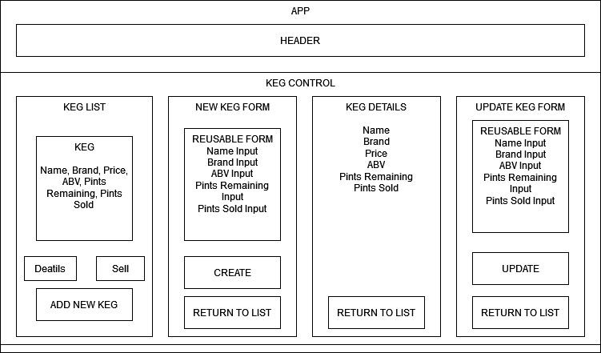

# The Tap Room

#### By _**Jack Skelton**_

#### _A website to track and manage kegs for a tap room._

## Component Diagram

## Technologies Used

- HTML
- CSS & Bootstrap
- React
- NPM & Webpack

## Description

A website to track and manage kegs for a tap room.

## Setup/Installation Requirements

- Navigate to the directory in which you would like to clone this project.
- Run `git clone https://github.com/JTSkelton/tap-room.git` in terminal.
- Run `cd tap-room` to navigate into new project directory.
- Open the cloned repo in a text editor of your choice.
- Run `npm install` to download all dependencies.
- Run `npm run start` to start a live server and view projec in the browser.
- Run `npm run test` to run tests.

## Known Bugs

- No known issues

## Contact Me

Let me know if you run into any issues or have questions, ideas or concerns:
dolanp1992@gmail.com

## License

_MIT_

Copyright (c) _2022_ _Patrick Dolan_
